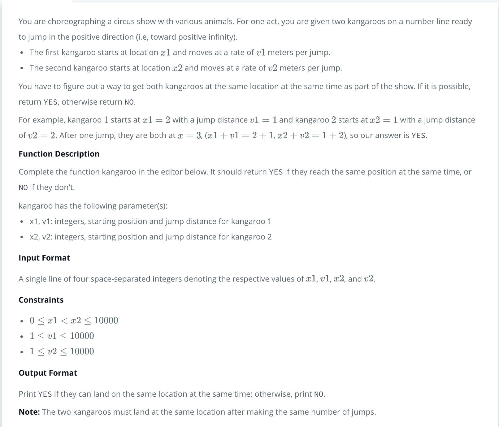
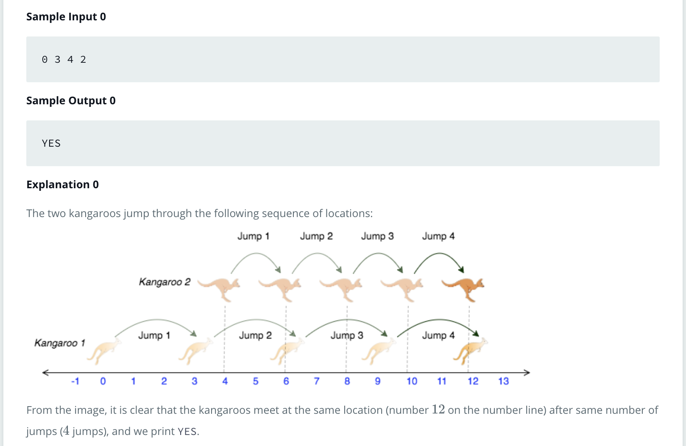
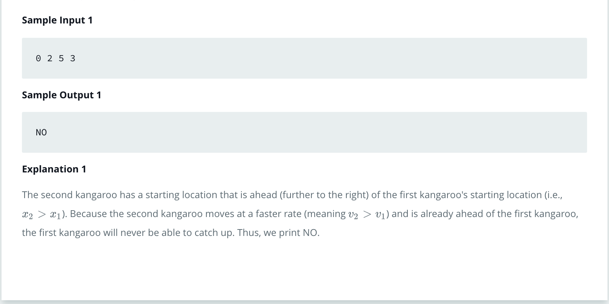

HackerRank Kangaroo Swift 4
===

## 1. Descripción
<br>
<p align="center">
	
</p>

<p align="center">
	
</p>

<p align="center">
	
</p>

## 2. Lógica

Para que se cumpla que ambos canguros se encuentren: 

1. Ambos canguros empiezan en el mismo lugar y ambos tienen el mismo desplazamiento

2. El canguro que lleva la delantera debe tener un desplazamiento menos que el que lo quiere alcanzar de otra manera nunca lo alcanzará

3. Si se cumple la condición 2, se va sumando el desplazamiento al punto inicial según cada canguro hasta que se encuentren, entonces regresa "YES", si el canguro que empezo más atrasado rebasa al canguro que iba más adelantado no se encuentran por lo tanto regresa "NO"

Nota: En el código el primer ciclo sólo entra 1 vez, el primer caso lo único que hace es invertir las variables, toda la lógica está en el 2do ciclo.

## 3. Solución

```swift
	import Foundation

// Complete the kangaroo function below.
func kangaroo(x1: Int, v1: Int, x2: Int, v2: Int) -> String {
        var inicio_canguro1 = x1
        var saltosCan1 = v1
        var inicio_canguro2 = x2
        var saltosCan2 = v2
        
        while true {
            if inicio_canguro1 > inicio_canguro2 && saltosCan2 > saltosCan1 {
                let aux_inicio_canguro1 = inicio_canguro1
                inicio_canguro2 = inicio_canguro1
                inicio_canguro1 = aux_inicio_canguro1
                
                let aux_saltosCan1 = saltosCan1
                saltosCan1 = saltosCan2
                saltosCan2 = aux_saltosCan1
                break
            }
            else if inicio_canguro2 > inicio_canguro1 && saltosCan1 > saltosCan2 {
                while true {
                    inicio_canguro1 += saltosCan1
                    inicio_canguro2 += saltosCan2
                    if inicio_canguro1 > inicio_canguro2 {
                        return "NO"
                    }
                    else if inicio_canguro1 == inicio_canguro2 {
                        return "YES"
                    }
                }
            }
            else if inicio_canguro1 == inicio_canguro2 && saltosCan1 == saltosCan2 {
                return "YES"
            }
            else {
                return "NO"
            }
        }
        return "NO"
}

let stdout = ProcessInfo.processInfo.environment["OUTPUT_PATH"]!
FileManager.default.createFile(atPath: stdout, contents: nil, attributes: nil)
let fileHandle = FileHandle(forWritingAtPath: stdout)!

guard let x1V1X2V2Temp = readLine() else { fatalError("Bad input") }
let x1V1X2V2 = x1V1X2V2Temp.split(separator: " ").map{ String($0) }

guard let x1 = Int(x1V1X2V2[0].trimmingCharacters(in: .whitespacesAndNewlines))
else { fatalError("Bad input") }

guard let v1 = Int(x1V1X2V2[1].trimmingCharacters(in: .whitespacesAndNewlines))
else { fatalError("Bad input") }

guard let x2 = Int(x1V1X2V2[2].trimmingCharacters(in: .whitespacesAndNewlines))
else { fatalError("Bad input") }

guard let v2 = Int(x1V1X2V2[3].trimmingCharacters(in: .whitespacesAndNewlines))
else { fatalError("Bad input") }

let result = kangaroo(x1: x1, v1: v1, x2: x2, v2: v2)

fileHandle.write(result.data(using: .utf8)!)
fileHandle.write("\n".data(using: .utf8)!)
```

